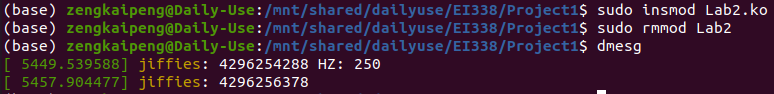

## Lab1 & Lab2

The content of these two labs are quite similar. In both lab we are required to design a module based on the given base module with some additional tasks. 

The additional task of Lab1 is 


The additional task of Lab2 is


To meet the additional requirement, only simple modification should be done to the given example module code in the book.

In Lab1, change the  `simple_init`  function and `simple_exit` function into these:

```C
int simple_init(void)
{
	// printk(KERN_INFO "Loading Kernel Module\n");
	printk(KERN_INFO "%llu\n", GOLDEN_RATIO_PRIME);
	return 0;
}

void simple_exit(void)
{
	// printk(KERN_INFO "Removing Kernel Module\n");
	printk(KERN_INFO "%lu\n", gcd(3300, 24));
}
```

In Lab2, change `simple_init` function and `simple_exit`  function into these:

```C
int simple_init(void)
{
	// printk(KERN_INFO "Loading Kernel Module\n");
	printk(KERN_INFO "jiffies: %lu HZ: %d\n", jiffies, HZ);
	return 0;
}

void simple_exit(void)
{
	// printk(KERN_INFO "Removing Kernel Module\n");
	printk(KERN_INFO "jiffies: %lu\n", jiffies);
}
```

The required information can be printed when the module is loaded and removed.

Compile the source code according to the make file (which will given at the end of the report), we will have the corresponding module file. use `insmod` command and `rmmod` command to install and remove the module, we can see the kernel information in the kernel buffer. 

#### Result of Lab1


From the figure above, we can see the value of `GOLDEN_RATIO_PRIME` is 7046029254386353131, and the greatest common divider of 3300 and 24 is 12.

#### Result of Lab2



From the figure above, we can see the value of `jiffies` when load and remove the module. And the `HZ` value is 250.

## Assignment1 & Assignment2

The content of these two assignments are quite similar too. To meet the requirement, only little modification should be done based on the example code given in **P5-P6** 

### Assignment1

The task of assignment1 is to design a kernel module that create a `/proc`  file name `/proc/jiffies` to report the current value of `jiffies`.  The only modification is about the `proc_read` function. In this function, we need to write the value of the current `jiffies` and copy it to the user space. Also we need to change the `proc_name` so that the correct entry could be found in `/proc`

```C
#include <linux/init.h>
#include <linux/kernel.h>
#include <linux/module.h>
#include <linux/proc_fs.h>
#include <linux/uaccess.h>
#include <linux/jiffies.h>

#define BUFFER_SIZE 128
#define PROC_NAME "jiffies"

ssize_t proc_read(
	struct file *file, char __user *usr_buf,
	size_t count, loff_t *pos
);

static struct file_operations proc_ops = {
	.owner = THIS_MODULE,
	.read = proc_read,
};

int proc_init(void)
{
	/* creates the /proc/hello entry */
	proc_create(PROC_NAME, 0666, NULL, &proc_ops);
	return 0;
}

void proc_exit(void)
{
	remove_proc_entry(PROC_NAME, NULL);
}

ssize_t proc_read(
	struct file *file, char __user *usr_buf,
	size_t count, loff_t *pos
)
{
	int rv = 0;
	char buffer[BUFFER_SIZE];
	static int completed = 0;
	if(completed)
	{
		completed = 0;
		return 0;
	}
	completed = 1;
	rv = sprintf(buffer, "%lu\n", jiffies);
	copy_to_user(usr_buf, buffer, rv);
	return rv;
}

module_init(proc_init);
module_exit(proc_exit);
MODULE_LICENSE("GPL");
MODULE_DESCRIPTION("Assignment1");
MODULE_AUTHOR("SCG");
```

use `insmod` command to install the module and enter `cat /proc/jiffies` in terminal, we will have the result:


### Assignment2

In Assignment2, we are required to design a module to report the number of seconds that have elapsed since the kernel module was first loaded.   The use of SSE registers in kernel module is disabled, thus the module can only report the integer number of seconds. In this assignment, in the `proc_init` function, we need to store the value of `jiffies` as `load_jiffies`. Change the `proc_read` function so that every time this `/proc/seconds` is read, the module can report the seconds according to the equation $Seconds=\frac{\Delta jiffies}{HZ}$. 

```C
#include <linux/init.h>
#include <linux/kernel.h>
#include <linux/module.h>
#include <linux/proc_fs.h>
#include <linux/uaccess.h>
#include <linux/jiffies.h>
#include <asm/param.h>

#define BUFFER_SIZE 128
#define PROC_NAME "seconds"

const int hz = HZ;

unsigned long volatile load_jif, now_jif;

ssize_t proc_read(
	struct file *file, char __user *usr_buf,
	size_t count, loff_t *pos
);

static struct file_operations proc_ops = {
	.owner = THIS_MODULE,
	.read = proc_read,
};

int proc_init(void)
{
	/* creates the /proc/hello entry */
	proc_create(PROC_NAME, 0666, NULL, &proc_ops);
	load_jif = jiffies;
	return 0;
}

void proc_exit(void)
{
	remove_proc_entry(PROC_NAME, NULL);
}

ssize_t proc_read(
	struct file *file, char __user *usr_buf,
	size_t count, loff_t *pos
)
{
	int rv = 0;	
	char buffer[BUFFER_SIZE];
	static int completed = 0;
	if(completed)
	{
		completed = 0;
		return 0;
	}
	completed = 1;
	now_jif = jiffies;
	rv = sprintf(buffer, "%lu\n", (now_jif - load_jif) / hz);
	copy_to_user(usr_buf, buffer, rv);
	return rv;
}

module_init(proc_init);
module_exit(proc_exit);
MODULE_LICENSE("GPL");
MODULE_DESCRIPTION("Assignment2");
MODULE_AUTHOR("SCG");
```

use `insmod` command to install the module and enter `cat /proc/seconds` in terminal, we will have the result:


## Makefile

```shell
obj-m +=Lab1.o
obj-m +=Lab2.o
obj-m +=Assignment1.o
obj-m +=Assignment2.o
PWD :=$(shell pwd)
KERNEL_PATH :=/usr/src/linux-headers-$(shell uname -r)

all:
	make -C $(KERNEL_PATH) M=$(PWD) modules

clean:
	make -C $(KERNEL_PATH) M=$(PWD) clean
```

