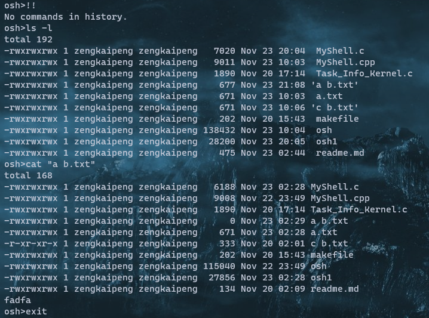
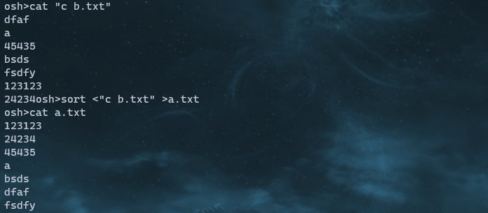
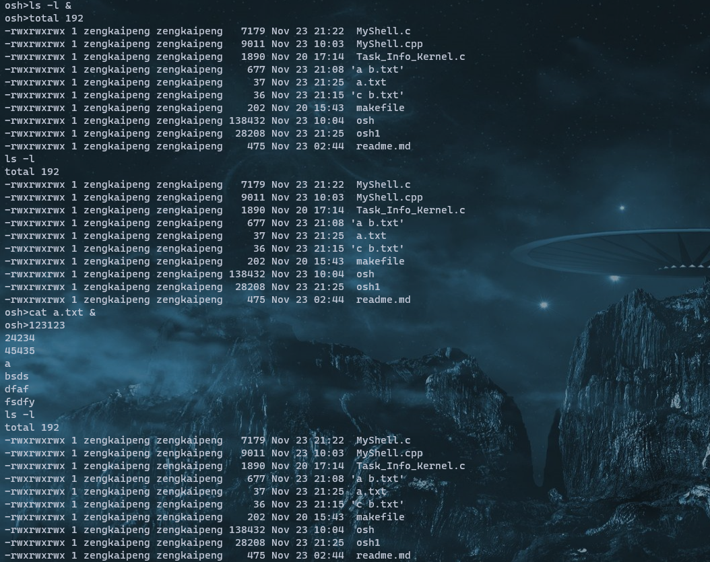
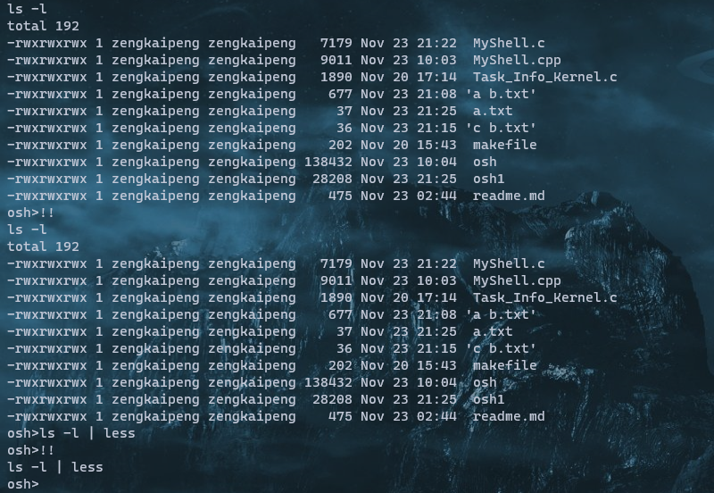
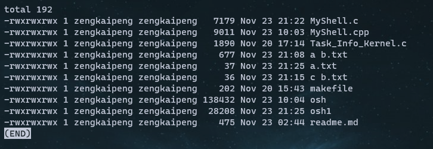
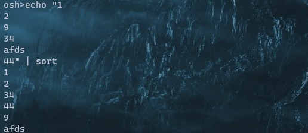
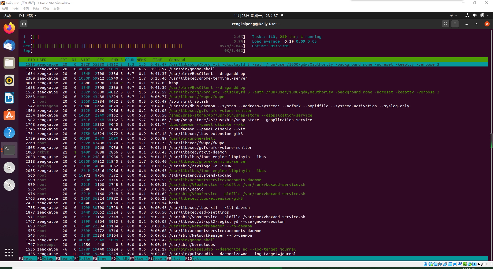
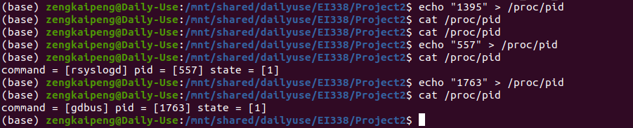

## Project 2-1 UNIX Shell

### Content of Project

In this project, we are supposed to implement a $\texttt{C}$ program to serve as a shell interface that accepts user commands and then executes each command in a separate process.  This Project is organized into following four parts:

1. Creating the child process and executing the command in the child.
2. Providing a history feature.
3. Adding support of input and output redirection.
4. Allowing the parent and child processes to communicate via a pipe.

### Organization of Codes

The codes can be roughly divided into three parts: the input part, the string split part and command execution part.

#### Input Part

Use `getchar()` function to fetch command from `stdin` until it meets a line break. The usage of quotation marks in my toy UNIX shell is supported, so I need to check whether the line break in inside a pair of quotation marks additionally. The command line can be separated into chunks according to spaces outside quotation marks or operators like "|", ">" and "<". To make the input command easier to deal with, apply a small modification while fetching the command from `stdin` so that the every operands and operators are separated with a single space.

```C
char Skip_Space(void)
{
	char ch;
	while((ch = getchar()) == ' ');
	return ch;
}
int main(void)
{
    /*Omitted Codes*/
    /*
	Simple syntax error detection
	The useage of quotation marks are supported
	*/

    char first_char = Skip_Space(), *curr = cmdline;
    int Is_quo = (first_char == '"'), iswait = 1, toswap = 1;
    if(first_char == '|')
    {
        for(;;)
        {
            if(first_char == '\n' && Is_quo == 0) break;
            Is_quo ^= ((first_char = getchar()) == '"');
        }
        printf("syntax error near unexpected token `|'\n");
    }
    if(first_char == '|' || first_char == '\n') continue;

    /*
	Input Part
	*/

    for(char ch = first_char; ;)
    {
        if(ch == '\n' && Is_quo == 0) break;
        *(curr++) = ch;
        if(Is_quo == 1)
        {
            while((ch = getchar()) != '"')
                *(curr++) = ch;
            *(curr++) = ch; ch = ' '; Is_quo = 0;
        }
        else if(ch == ' ')
            Is_quo ^= ((ch = Skip_Space()) == '"');
        else
            Is_quo ^= ((ch = getchar()) == '"');

        if(Is_Operator(&ch))
        {
            if(curr != cmdline && *(curr - 1) != ' ')
                (*curr++) = ' ';
            *(curr++) = ch; ch = ' ';
        }
    }
    (*curr++) = '\0';
	/*Omitted Codes*/
}
```

#### String Split

After the first part, the command line well organized. Every parameter and operators can be easily separated according to the blanks. The following function is designed for this.

```C
int Convert_To_Args(
	int *iswait, char *cmdline, char *args[],
	char *secargs[], char *ipdir, char *opdir
)
{
	char **curr = args;
	int lspace = 0, rspace = 0, lst = 0;
	int *cspace = &lspace, lasti;
	for(int i = 0; cmdline[i] != '\0'; lasti = ++i)
	{
		if(cmdline[i] == '|')
		{
			curr[*cspace] = NULL, ++i;
			curr = secargs, cspace = &rspace;
		}
		else if(cmdline[i] == '<' || cmdline[i] == '>')
		{
			char *udir = cmdline[i] == '<' ? ipdir : opdir;
			if(cmdline[i += 2] == '\0')
			{
				args[lspace] = secargs[rspace] = NULL;
				return 1;
			}
			if(cmdline[i] == '"')
			{
				for(lst = 1; cmdline[i + lst] != '"'; ) ++lst;
				for(int j = 1; j < lst; ++j) udir[j - 1] = cmdline[i + j];
				udir[lst - 1] = '\0', i = i + lst, lst = 0;
			}
			else
			{
				for(lst = 0; cmdline[i + lst] != ' ' && cmdline[i + lst] != '\0'; ) ++lst;
				for(int j = 0; j < lst; ++j) udir[j] = cmdline[i + j];
				udir[lst] = '\0', i = i + lst - 1, lst = 0;
			}
		}
		else if(cmdline[i] == '"')
		{
			for(lst = 0; cmdline[i + lst] != '"'; ) ++lst;
			curr[*cspace] = (char *) malloc(sizeof(char) * (lst + 5));
			for(int j = 1; j < lst; ++j)
				curr[*cspace][j - 1] = cmdline[i + j];
			curr[*cspace][lst - 1] = '\0', *cspace += 1, i = lst + i, lst = 0; 
		}
		else if(cmdline[i] == ' ')
		{
			if(lst > 0)
			{
				curr[*cspace] = (char *) malloc(sizeof(char) * lst + 5);
				for(int j = lst; j >= 1; --j)
					curr[*cspace][lst - j] = cmdline[i - j];
				curr[*cspace][lst] = '\0', *cspace += 1, lst = 0;
			}
		}
		else if(cmdline[i] == '&')
			*iswait = 0, lst = 0;
		else lst += 1;
	}
	if(lst > 0)
	{
		curr[*cspace] = (char *) malloc(sizeof(char) * lst + 5);
		for(int j = lst; j >= 1; --j)
			curr[*cspace][lst - j] = cmdline[lasti - j];
		curr[*cspace][lst] = '\0', *cspace += 1, lst = 0;
	}
	curr[*cspace] = NULL;
	return 0;
}
```

#### Execution part

The getting all the parameters, we can create sub-process to execute every command. Two special commands require special operations:

1. `exit`. When this command is detected, the toy shell should terminate.
2. `!!`. When this command is detected, the final executed command should be printed to the screen and executed again.

```C
int main(void)
{
    /*Omitted Codes*/
	int synerr = Convert_To_Args(
        &iswait, cmdline, current_args, 
        csecond_args, input_dir, output_dir
    );

    if(synerr)
        printf("syntax error near unexpected token `newline'\n");
    else
    {
        if(strcmp(current_args[0], "exit") == 0)
            should_run = 0;
        else
        {
            char **uarg = current_args, **uarg2 = csecond_args;
            int exeable = 1;
            if(strcmp(current_args[0], "!!") == 0)
            {
                if(strlen(lcmd) == 0) exeable = 0;
                else printf("%s\n", lcmd);
                iswait = last_wait; toswap = 0; uarg = last_args; uarg2 = lsecond_args; 
                strcpy(input_dir, linput_dir); strcpy(output_dir, loutput_dir);
            }
            if(exeable)
            {
                if(uarg2[0] == NULL)
                {
                    int fin = -2, fout = -2;
                    if(strlen(input_dir) != 0) fin = open(input_dir, O_RDONLY);
                    if(strlen(output_dir) != 0) fout = open(output_dir, O_WRONLY | O_CREAT | O_TRUNC, 0666);
                    if(fin == -1 || fout == -1)
                        printf("Fail to open file!");
                    else
                    {
                        pid_t pid = fork();
                        if(pid < 0)
                        {
                            printf("Fail to Create subprocess!");
                            exit(-1);
                        }
                        if(pid == 0)
                        {
                            if(fin != -2) dup2(fin, STDIN_FILENO);
                            if(fout != -2) dup2(fout, STDOUT_FILENO);
                            execvp(uarg[0], uarg);
                            exit(0);
                        }
                        else if(iswait) waitpid(pid, NULL, 0);
                    }
                    if(fin != -1 && fin != -2) close(fin);
                    if(fout != -1 && fout != -2) close(fout);
                }
                else
                {
                    pid_t pid = fork();
                    if(pid < 0)
                    {
                        printf("Fail to Create subprocess!");
                        exit(-1);
                    }
                    else if(pid == 0)
                    {
                        int fd[2] = {0};
                        if(pipe(fd) < 0)
                            printf("Pipe Error!\n");
                        else
                        {
                            pid_t pid2 = fork();
                            if(pid2 == 0)
                            {
                                dup2(fd[1], STDOUT_FILENO);
                                execvp(uarg[0], uarg);
                                exit(0);
                            }
                            if(pid2 > 0)
                            {
                                wait(NULL); close(fd[1]);
                                fcntl(fd[0], F_SETFL, O_NONBLOCK);
                                if(strcmp(uarg2[0], "exit") == 0)
                                    should_run = 0;
                                else
                                {
                                    dup2(fd[0], STDIN_FILENO);
                                    execvp(uarg2[0], uarg2);
                                    exit(0);
                                }
                            }
                        }
                    }
                    else waitpid(pid, NULL, 0);
                }
            }
            else printf("No commands in history.\n");
        }
    }
    /*Omitted Codes*/
}
```

#### Other Part

Other Parts of the codes are not so important, including storing the previous commands, allocating and freeing memories and so on. For detailed information, check https://github.com/zengkaipeng/EI338-Project/tree/main/Project2.

### Result

The test of the toy shell starts from some simple commands as follows:



The second part consists of some file redirect operations and commands with ampersand  at the end:





The third part consists of some simple pipe operations and history tracking operations:



The execution result of `ls -l | less`





## Project 2-2 **Linux Kernel Module for Task Information**

### Content of Project

In this project, we are supposed to write a Linux kernel module that uses the `/proc` file system for displaying a task’s information based on its process identifier value `pid`.  This project will involve writing a process identifier to  the file `/proc/pid`. Once a `pid` has been written to the `/proc` file, subsequent reads from `/proc/pid` will report

1. the command the task is running  
2. the value of the task’s `pid`
3. the current state of the task  

### Organization of Codes

To finish the write operation, the implementation of a `write_proc` function additionally based on our last project is necessary. In this function, the input from the terminal will be converted from a string to a number, and stored in a global variable. Also we need to apply some modification to the `proc_read` function. In this function, we need to use `find_vpid`  and `pid_task` function to get information of the corresponding process. If there is no such process, the function will return zero.

```C
#include <linux/init.h>
#include <linux/kernel.h>
#include <linux/module.h>
#include <linux/proc_fs.h>
#include <linux/uaccess.h>
#include <linux/slab.h>
#include <linux/jiffies.h>
#include <linux/sched.h>

#define BUFFER_SIZE 256
#define PROC_NAME "pid"

static long pid_num = 0;

ssize_t proc_read(
	struct file *file, char __user *usr_buf,
	size_t count, loff_t *pos
);

ssize_t proc_write(
	struct file *file, const char __user *usr_buf,
	size_t count, loff_t *pos
);

static struct file_operations proc_ops = {
	.owner = THIS_MODULE,
	.read = proc_read,
	.write = proc_write,
};

int proc_init(void)
{
	/* creates the /proc/hello entry */
	proc_create(PROC_NAME, 0666, NULL, &proc_ops);
	return 0;
}

void proc_exit(void)
{
	remove_proc_entry(PROC_NAME, NULL);
}

ssize_t proc_read(
	struct file *file, char __user *usr_buf,
	size_t count, loff_t *pos
)
{
	int rv = 0;
	char buffer[BUFFER_SIZE];
	static int completed = 0;
	struct pid *Vpid = NULL;
	struct task_struct *tsk = NULL;
	if(completed)
	{
		completed = 0;
		return 0;
	}
	// printk(KERN_INFO "pnum: %ld", pid_num);
	completed = 1;
	Vpid = find_vpid(pid_num);
	tsk = pid_task(Vpid, PIDTYPE_PID);
	if(tsk == NULL) return 0;
	
	rv = sprintf(
		buffer, "command = [%s] pid = [%d] state = [%ld]\n",
		tsk -> comm, tsk -> pid, tsk -> state
	);
	
	copy_to_user(usr_buf, buffer, rv);
	return rv;
}

ssize_t proc_write(
	struct file *file, const char __user *usr_buf,
	size_t count, loff_t *pos
)
{
	char *k_mem;
	k_mem = kmalloc(count, GFP_KERNEL);
	copy_from_user(k_mem, usr_buf, count);
	kstrtol(k_mem, 10, &pid_num);
	// printk(KERN_INFO "num: %ld\n", pid_num);
	kfree(k_mem);
	return count;
}

module_init(proc_init);
module_exit(proc_exit);
MODULE_LICENSE("GPL");
MODULE_DESCRIPTION("Task Information Kernel");
MODULE_AUTHOR("SCG");
```

### Result

The following figures shows the test result. Use `htop` to get all the running process



Use following command to test the kernel module, the result shows that:

1. There is no such process that `pid=1395`, thus nothing will be printed to the screen
2. The corresponding information of the processes whose `pid` is `557` and `1763` is printed out. 



Thus the kernel module works well.

### Makefile

This $\texttt{makefile}$ is used for compiling the kernel module

```Shell
obj-m +=Task_Info_Kernel.o
PWD :=$(shell pwd)
KERNEL_PATH :=/usr/src/linux-headers-$(shell uname -r)

all:
	make -C $(KERNEL_PATH) M=$(PWD) modules

clean:
	make -C $(KERNEL_PATH) M=$(PWD) clean
```

