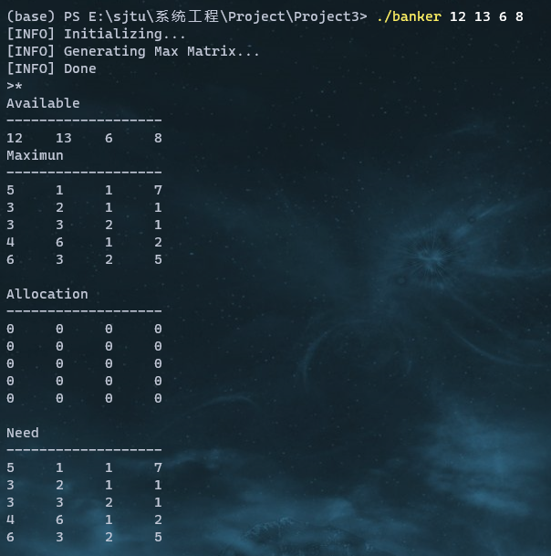
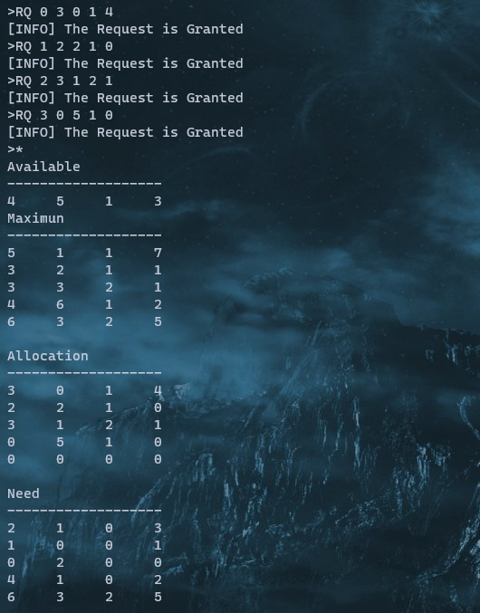
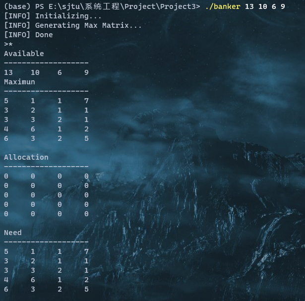

## Project 3 Banker's Algorithm

### Content of Project

In this project, we are supposed to implement Banker's Algorithm discussed in Section 8.6.3 of textbook. Customers request and release resources from
the bank. The banker will grant a request only if it leaves the system in a safe state. A request that leaves the system in an unsafe state will be denied.  Two functions are to be implements:

1. ` int request_resources(int customer_num, int request[])` 
2. `void release_resources(itn customer_num, int release[])`

The `request_resources` function will return `0` if the request is granted and return -1 otherwise.

### Organization of Codes

#### Basic Definition

The operations  to the resources' states (`Available` resources, `Need` and `Allocation` situation of a single process), like releasing or allocating, can be considered as vector operations.  To simplify the organization of codes and promote readable codes, I construct a `struct` for vector operations:

```c++
struct Vec
{
	int len, *num;
	Vec(){ len = 0, num = NULL; }
	Vec(int _l, int *S)
	{
		len = _l; num = new int[_l + 5];
		for(int i = 0; i < len; ++i)
			num[i] = S[i];
	}
	Vec(int _l, int T)
	{
		len = _l; num = new int[_l + 5];
		for(int i = 0; i < len; ++i)
			num[i] = T;
	}
	Vec(const Vec&yu)
	{
		len = yu.len; num = new int[len + 5];
		for(int i = 0; i < len; ++i)
			num[i] = yu.num[i];
	}
	~Vec()
	{
		if(num != NULL)
			delete []num;
	}
	Vec&operator=(const Vec&yu)
	{
		if(num != NULL) delete []num;
		len = yu.len; num = new int[len + 5];
		for(int i = 0; i < len; ++i)
			num[i] = yu.num[i];
		return *this;
	}
	Vec operator+(const Vec&yu)const
	{
		Vec ans = *this;
		for(int i = 0; i < ans.len; ++i)
			ans.num[i] += yu.num[i];
		return ans;
	}
	Vec operator-(const Vec&yu)const
	{
		Vec ans = *this;
		for(int i = 0; i < ans.len; ++i)
			ans.num[i] -= yu.num[i];
		return ans;
	}
	void output(bool sline=false, int width=6)
	{
		char msg[20];
		sprintf(msg, "%c%c%dd", '%', '-', width);
		for(int i = 0; i < len; ++i)
			printf(msg, num[i]);
		if(sline) puts("");
	}
	Vec&operator-=(const Vec&yu)
	{
		for(int i = 0; i < len; ++i)
			num[i] -= yu.num[i];
		return *this;
	}
	Vec&operator+=(const Vec&yu)
	{
		for(int i = 0; i < len; ++i)
			num[i] += yu.num[i];
		return *this;
	}
	void reset(int x=0)
	{
		for(int i = 0; i < len; ++i)
			num[i] = x;
	}
	bool operator<=(const Vec&yu)const
	{
		for(int i = 0; i < len; ++i)
			if(num[i] > yu.num[i])
				return false;
		return true;
	}
};
```

#### Initiation

At initiation part of the algorithm, the program generate the `Available` vector according to the passed parameters. And the program gets the maximum number of requests for each resource from the file $\texttt{Max.txt}$.  `Allocation` of every process is set as 0 initially and we can generate the `Need` matrix via `Need = Max-Allocation`.

```c++
inline int getint(FILE *f, bool &ef)
{
	char C; int u; bool o(false);
	while((C = fgetc(f)) > 57 || C < 48)
	{
		if(C == EOF)
		{
			ef = true;
			return -1;
		}
		o |= C == '-';
	}
	u = C - '0';
	while((C = fgetc(f)) > 47 && C < 58)
		u += u + (u << 3) + C - 48;
	return o ? -u : u;
}
Vec Available;
vector<Vec> Max, Allocation, Need;
int customer_cnt, resource_cnt;
int main(int argc, char *argv[])
{
	printf("[INFO] Initializing...\n");
	int *nums = new int[argc + 1];
	for(int i = 1; i < argc; ++i)
		nums[i - 1] = atoi(argv[i]);
	
	Available = Vec(argc - 1, nums);
	resource_cnt = argc - 1;
	
	printf("[INFO] Generating Max Matrix...\n");
	FILE * fmax = fopen("Max.txt", "r");
	for(int p, tc(0); true;)
	{
		bool fl = false;
		p = getint(fmax, fl);
		if(fl) break;
		nums[tc++] = p;
		if(tc == argc - 1)
		{
			Max.push_back(Vec(tc, nums));
			Need.push_back(Vec(tc, nums));
			Allocation.push_back(Vec(tc, 0));
			tc = 0;
		}
	}
	fclose(fmax);
	customer_cnt = Max.size();
	printf("[INFO] Done\n");
}
```

#### Safety Check

Checking whether the current state is safe is one of the central part of the whole algorithm. The safety checking part works as follows:

1. Create a vector `Work` using `Available` as the initial value. Mark all the processes as unfinished.
2. Find an unfinished process $i$ whose `Need`$_i\le$ `Work`.  If there is no such $i$ , go to step 4.
3. Mark process $i$ as finished and add `Allocation`$_i$ to `Work`.
4. If all processes are marked as finished, the state is safe. Otherwise, the state is unsafe.

```c++
inline bool Check_Safety()
{
	bool *Finish = new bool[customer_cnt + 5], tfind;
	memset(Finish, 0, sizeof(bool) * (customer_cnt + 5));
	Vec Work = Available;
	for(int i = 0; i < customer_cnt; ++i)
	{
		tfind = false;
		for(int j = 0; j < customer_cnt; ++j)
			if(!Finish[j] && Need[j] <= Work)
			{
				Work += Allocation[j];
				tfind = Finish[j] = true;
				break;
			}
		if(!tfind) break;
	}
	delete []Finish;
	return tfind;
}
```

#### Resource Requesting

With the safety check algorithm, we can easily implement the resource requesting function. When a request appears, if this request satisfied the following two constraints, the request can be granted:

1. This request is less than the `Need` of this process.
2. If this request is granted, the new state is still a safe state.

```c++
inline int request_resources(int customer_num, int request[])
{
	Vec tvec = Vec(resource_cnt, request);
	if(tvec <= Need[customer_num])
	{
		Allocation[customer_num] += tvec;
		Need[customer_num] -= tvec;
		Available -= tvec;
		if(Check_Safety()) return 0;
		else
		{
			Allocation[customer_num] -= tvec;
			Need[customer_num] += tvec;
			Available += tvec;
		}
	}
	return -1;
}
```

#### Resource Releasing

In this part, three operations should be done:

1. Add the resource to release back to `Available`
2. Decrease the `Allocation` by the resource to release.
3. Add the resource to release back to `Need` of this process

With these operations, the resources is released and the equation `Need = Max-Allocation` is maintained.

```c++
void release_resources(int customer_num, int release[])
{
	Vec tvec = Vec(resource_cnt, release);
	if(tvec <= Allocation[customer_num])
	{
		Allocation[customer_num] -= tvec;
		Available += tvec;
		Need[customer_num] += tvec;
		puts("[INFO] Resources Released");
	}
	else
		puts("[INFO] Not So Much Resources to Release");
}
```

#### State Outputting

```c++
if(strcmp(cmd, "*") == 0)
{
	puts("Available\n-------------------");
	Available.output();
	puts("");
	puts("Maximun\n-------------------");
	for(veit it = Max.begin(); it != Max.end(); ++it)
		it -> output(true);
	puts("");
	puts("Allocation\n-------------------");
	for(veit it = Allocation.begin(); it != Allocation.end(); ++it)
		it -> output(true);
	puts("");
	puts("Need\n-------------------");
	for(veit it = Need.begin(); it != Need.end(); ++it)
		it -> output(true);
	puts("");
}
```

### Result

To verify the correctness of the code, I use data of problem (b), Assignment 11 as test case.

If a request is granted, the program will output `[INFO] The Request is Granted`

If a request is denied, the program will output `[INFO] Fail to Grant the Request`

#### Case 1

<center class='half'>
	
</center>
#### Case 2
<center class='half'>
	
</center>


### Note

To check the complete code, please visit https://github.com/zengkaipeng/EI338-Project/tree/main/Project3.