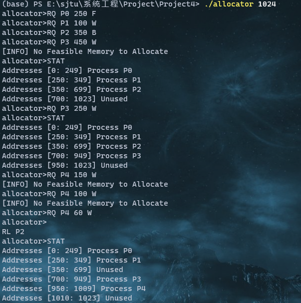

## Project4 Contiguous Memory Allocation

### Content of Project

This project will involve managing a contiguous region of memory of size  $MAX$ where addresses may range from  $0\ldots MAX$.  The memory allocation program must response to four different requests:

1. Request for a contiguous block of memory  
2. Release of a contiguous block of memory  
3. Compact unused holes of memory into one single block  
4. Report the regions of free and allocated memory  

The program will be passed a initial amount of memory via `argv` and response to four commands `RQ` (request), `RL` (release), `C` (compact), `X`(exit).

Also three strategy of allocating memory are to be implemented:

1. `F` for first fit
2. `B` for best fit
3. `W` for worst fit 

### Organization of Codes

#### Basic Definition

The number of memory blocks and requests are unknown. To make the management of memory easier, a link list is constructed as follows:

```c++
typedef long long ll;
ll MAX;

struct Mem_Block
{
	ll size, start; char *Process_Name;
	Mem_Block *Pre, *Next;
	bool Occupied;
	Mem_Block() 
	{ 
		start = size = 0, Pre = Next = NULL; 
		Occupied = false; Process_Name = NULL; 
	}
	Mem_Block(ll _s, ll _st, char *ps=NULL, bool _O=false, Mem_Block *P=NULL, Mem_Block *N=NULL) 
	{
		size = _s; start = _st; Pre = P; Next = N; Occupied = _O;
		if(ps == NULL) Process_Name = NULL;
		else
		{
			int len = strlen(ps);
			Process_Name = new char[len + 5];
			strcpy(Process_Name, ps);
		}
	}
	~Mem_Block()
	{
		if(Process_Name != NULL)
			delete []Process_Name;
	}
	void Release(){ Occupied = false; }
	void Output(const char *End="")
	{
		printf("Addresses [");
		std::cout << start << ": " << start + size - 1;
		printf("] %s", Occupied ? "Process" : "Unused");
		if(Occupied) printf(" %s", Process_Name);
		printf("%s",End);
	}
}*Fst;
```

At the beginning of the program, the total amount of memory will be passed by `argv`, Then we can construct our first memory block according to the passed message.

```c++
int main(int argc, char **argv)
{
	if(argc < 2)
	{
		printf("[INFO] Start Without Initial Information\n");
		return 0;
	}
	MAX = atoll(argv[1]);
	Fst = new Mem_Block(MAX, 0);
	
	/* Initiation Ends */
	
	printf("allocator>");
	
	char cmd[20], Process_Name[50], Policy;
	ll Req_Size;
	while(true)
	{
		scanf(" %s", cmd);
		if(strcmp(cmd, "X") == 0)
			break;
		if(strcmp(cmd, "C") == 0)
			Compact();
		if(strcmp(cmd, "STAT") == 0)
			Output_Mem();
		if(strcmp(cmd, "RL") == 0)
		{
			scanf(" %s", Process_Name);
			Release_Mem(Process_Name);
		}
		if(strcmp(cmd, "RQ") == 0)
		{
			scanf(" %s", Process_Name);
			std::cin >> Req_Size;
			scanf(" %c", &Policy);
			int tx = Request_Mem(Process_Name, Req_Size, Policy);
			if(tx == -1)
				printf("[INFO] No Feasible Memory to Allocate\n");
		}
		printf("allocator>");
	}
	
	Mem_Block *it1 = Fst, *it2 = Fst->Next;
	while(it2)
	{
		delete it1;
		it1 = it2; 
		it2 = it1->Next;
	}
	delete it1;
	
	return 0;
}
```

#### Requesting a Memory Block

Two operations are necessary for requesting a memory block:

1. Find a feasible unoccupied memory block according to the given policy. 
2. Allocate part of the found memory block to the process.

```c++
Mem_Block* Find_Block(ll Size, char Policy)
{
	if(Policy == 'F')
	{
		Mem_Block *Ans = Fst;
		for(; Ans != NULL; Ans = Ans->Next)
			if(Ans->size >= Size && !Ans->Occupied)
				break;
		return Ans;
	}
	if(Policy == 'W' || Policy == 'B')
	{
		Mem_Block *Ans = NULL;
		for(Mem_Block *it = Fst; it != NULL; it = it->Next)
			if(it->size >= Size && !it->Occupied)
			{
				if(Ans == NULL) Ans = it;
				else
				{
					bool fl = Policy == 'W' ?
							  (Ans->size < it->size) :
							  (Ans->size > it->size);
					if(fl) Ans = it;
				}
			}
		return Ans;
	}
	return NULL;
}
```

The function above are to find the feasible memory block. For the "first fit" policy, the function will return the first memory block whose size is greater than or equal to the required memory size. The "best fit" policy will return the smallest memory block among those whose size is not less than the required while the "worst fit" policy returns the biggest one. If there are no feasible block, the function will return `NULL`.

Then A new block will be created in the front of the found block and the remaining space of the found block will be modified. If there are no spaces left, the found block will be removed. 

```c++
void Remove_Block(Mem_Block *Now)
{
	if(Now->Pre)  Now->Pre->Next = Now->Next;
	if(Now->Next) Now->Next->Pre = Now->Pre;
	delete Now;
}
int Request_Mem(char *Process_Name, ll Size, char Policy)
{
	Mem_Block *Nb = Find_Block(Size, Policy);
	if(Nb == NULL) return -1;
	
	Mem_Block *Nm = new Mem_Block(
		Size, Nb->start, Process_Name, 
		true, Nb->Pre, Nb
	);
	
	if(Nb->Pre)	Nb->Pre->Next = Nm;
	Nb->Pre = Nm; Nb->size -= Size; 
	Nb->start += Size;
	
	if(Nb == Fst) Fst = Nm;
	if(Nb->size == 0) Remove_Block(Nb);
	return 1;
}
```

The function above is designed for allocating memory for a single request. If the request is granted, the function will return 1. Otherwise, the function will return -1. 

#### Releasing Memory

When releasing the controlled memory blocks of a given process, two operations are required:

1. Set the memory block into unoccupied state.
2. If the neighborhood of this block is also unoccupied, merge these blocks together.

Also, we need to update the pointer pointing to the first memory block, if the original first one is merged by its neighborhood.

```c++
void Release_Mem(const char* Process_Name)
{
	for(Mem_Block *it = Fst; it; it = it->Next)
		if(it->Occupied)
			if(strcmp(it->Process_Name, Process_Name) == 0)
			{
				it->Release();
				if(it->Pre)
					if(!it->Pre->Occupied)
					{
						it->size += it->Pre->size;
						it->start = it->Pre->start;
						if(it->Pre == Fst) 
							Fst = it;
						Remove_Block(it->Pre);
					}
				if(it->Next)
					if(!it->Next->Occupied)
					{
						it->size += it->Next->size;
						Remove_Block(it->Next);
					}
			}
}
```

#### Compaction

This operation will shuffle all the memory content, so that the free memories will gather together into one block. To do this, We need to construct a new block at end of the whole memory series, and merge all the unoccupied space of memories into it. After this operation, most of the start points of the occupied memory blocks is changed, thus we need a recalculation.

```c++
void Recal_Start()
{
	Fst->start = 0;
	for(Mem_Block *it = Fst->Next; it; it = it->Next)
		it->start = it->Pre->start + it->Pre->size;
}
void Compact()
{
	Mem_Block *tail = Fst;
	while(tail->Next) tail = tail->Next;
	
	ll Available = 0;
	for(Mem_Block *it = Fst; it; it = it->Next)
		if(!it->Occupied) Available += it->size;
	
	tail->Next = new Mem_Block(
		Available, 0, NULL, false, 
		tail, NULL
	);
	
	Mem_Block *it1 = Fst, *it2 = Fst->Next;
	while(it2)
	{
		if(!it1->Occupied) 
		{
			if(it1 == Fst)
				Fst = it1->Next;
			Remove_Block(it1);
		}
		it1 = it2; it2 = it1->Next;
	}
	Recal_Start();
}
```

#### Output

The output of the usage of the memory is quite easy. Follow the link list and output the information of every node, we will have the usage of the whole memory.

```c++
void Output_Mem()
{
	for(Mem_Block *it = Fst; it != NULL; it = it->Next)
		it->Output("\n");
}
```

### Result




### Note

The Codes shown in the report are the core functions of the program. To see the complete code, visit https://github.com/zengkaipeng/EI338-Project/tree/main/Project4.

